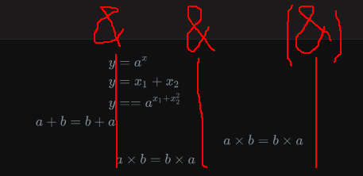

# 前言

偶然想起来已经说了很久要学LaTex然而一直没什么动静了，被问到`如何在上标里放下标`，本以为是`x^R~n~^`结果在csdn的markdown里打出来是x^R~n~^(更新：额pandoc渲染可真强，总之csdn上不支持嵌套啦)

淦，markdown的上下标似乎不能嵌套。

好的，那么趁机学学LaTex好了。先摆出效果图：$x^{R_n}$

<!--more-->

# 理解和运用

以下内容主要参考*Markdown中写数学公式*[^2]和*Markdown下LaTeX公式、编号、对齐*[^3]以及*CSDN Markdown 公式指导手册*[^4]

## 块级(block)公式/行内(inline)公式

LaTex都会用\$包裹起来。比如`$$……$$`和`$……$`，区别在于\$\$是块级公式，会独占一行，例如

$$
E=mc^2
$$


而\$是行内公式，例如$E=mc^2​$不会换行。

PS：这里额外提醒使用typora的小伙伴，你们会发现当你们键入`$$E=mc^2$$`的时候并不能打出换行的效果，看起来和行内的没有任何区别，这是typora处理上略微不同的地方（我比较认可），引用一下一位博主讲如何在typora里使用块级公式[^1]

> - 点击“段落”—>“公式块”
> - 快捷键Ctrl+Shift+m
> - “$$”+回车

试了便明白，对于typora来说会有这样的公式编辑界面（还会实时提示公式错误）


本质上说，typora只是**强制要求\$\$之间必须以单一换行符**隔开，因为\$\$语义上本身便是换行公式，这样保证了代码的可读性（md本身算代码这没毛病吧？）

后面的内容我都将分别以**源公式**和**效果**展示。

## 随便一个公式

```latex
$$y=ax+b$$
```

$$
y=ax+b
$$

## 公式上下标及移至正上下方

`^`符号表示上标，`_`表示下标，上下标可以相互嵌套。

上下标仅支持一个内容，用`{}`包裹可以将一多个内容作为一个整体

```latex
$y=a^x$
$y=x_1+x_2$
$y=a_1^x$
$y=a^{x_1+x_2^2}$
```

$y=a^x​$

$y=x_1+x_2$

$y=a_1^x$

$y=a^{x_1+x_2^2}$

如果需要将上下标移至**正上方**或者**正下方**则依然是`_{}`和`^{}`，不过需要使用`/limit_{}`或`/limit^{}`，如果同时有上下只需要一个`\limits`在前面即可。

下面拿取极限和求和的情况演示：

```latex
$\lim\limits_{x\to c}f(x)$
$\sum\limits_{i=1}^{n}a_i+b_i$
```

$\lim\limits_{x\to c}f(x)​$

$\sum\limits_{i=1}^{n}a_i+b_i​$

以上公式如果使用块级公式，则不需要加`\limits`，LaTex会将上下标自动调整到正上方正下方
$$
\lim\limits_{x\to c}f(x)
$$

$$
\sum_{i=1}^{n}a_i+b_i
$$


## 括号、绝对值和范式、向上向下取整

`()`,`[]`都是表示自己，但是`{}`在LaTex里有特殊作用，用`\lbrace`和`\rbrace`表示。`\langle`对应$\langle$ ，`\rangle`对应$\rangle$。

绝对值的竖线还是`|`，不过范式的双竖线是`\|`。

```latex
$$f(x, y) = 100 * \lbrace[(|x| + y + \|z\|) * 3] - 5\rbrace$$
```


$$
f(x, y) = 100 * \lbrace[(|x| + y + \|z\|) * 3] - 5\rbrace
$$

如果需要让括号变大,不管是`()`,`[]`,`{},`直接在符号前面加`\left`,`\right`即可。

```latex
$$
f(x,y,z) = 3y^2z \left( 3+\frac{7x+5}{1+y^2} \right)
$$
```


$$
f(x,y,z) = 3y^2z \left( 3+\frac{7x+5}{1+y^2} \right)
$$

哦还有两个括号，向上和向下取整

```latex
$$
\lfloor x\rfloor+\lceil x\rceil
$$
```

$$
\lfloor x\rfloor+\lceil x\rceil
$$

## 分数

有`\frac{分子}{分母}`和`\cfrac{分子}{分母}`，二者区别在于后者会把这一行撑开，不会太挤。

```latex
$\frac{x^{a_1}+3}{3}$
$\cfrac{x^{a_1}+3}{3}$
```

不带c $\frac{x^{a_1}+3}{3}$ 会适应这一行

带c $\cfrac{x^{a_1}+3}{3}​$会把这一行撑开

便捷情况可直接输入`\cfrac ab`来快速生成一个$\cfrac 12$

## 开方

开方使用`\sqrt[次数]{被开方数}`这样的语法

```latex
$\sqrt[4]{16}$
$\sqrt{x+5}$
```


$\sqrt[4]{16}=2$

$\sqrt{x+5}​$

## 矢量

```latex
$$
\vec{a}\cdot\vec{b}
$$
```

$$
\vec{a}\cdot\vec{b}
$$

## 积分与极限

### 积分

使用`\mathrm{d}`让微分符号`d`“竖起来”。

积分的上下限默认使用上下标。

```latex
$$
\int_{-\infty}^{+\infty}{x^2}\mathrm{d}x
$$
```

$$
\int_{-\infty}^{+\infty}{x^2}\mathrm{d}x
$$

而对重积分，二重积分是`\iint`，三重积分是`\iint`，以此类推，更多重可以使用`\idotsint`。

由于重积分的上下限由往往不再是上下限，而是集合形式在积分符号正下方，故需要使用`\limits_`，对于上方则是`\limits^`

```latex
$\iint\limits_{(x,y)\in D}{f(x,y)}\mathrm{d}x\mathrm{d}y$
```

$$
\iint\limits_{(x,y)\in D}{f(x,y)}\mathrm{d}x\mathrm{d}y
$$

### 极限

使用`\lim`输入取极限符号，其趋近箭头是`\to`，整体需要使用`\limits_{}`，将下标移至正下方（注：如果是块级公式可以不用`\limits_{}`，直接使用下标`_`即可）。

```latex
$$
\lim\limits_{n\to+\infty} \cfrac{1}{n(n+1)}
$$
```

$$
\lim\limits_{n\to+\infty} \cfrac{1}{n(n+1)}
$$

## 求和与求积

使用`\sum`,`\prod`分别表示求和与求积，上下标同样使用`\limits_{}`和`\limits^{}`移动至正上方/正下方

```latex
$\sum\limits^n_{i=1}i\times (i+1)$
$\prod\limits^n_{i=1}\cfrac{i}{(i+1)}$
```

$\sum\limits^n_{i=1}i\times (i+1)​$

$\prod\limits^n_{i=1}\cfrac{i}{(i+1)}$

## 特殊符号、函数

主要参考了某个大佬的文章[^5]

|                      | 符号              | LaTex             |
| :------------------- | ----------------- | :---------------- |
| 所有                 | $\forall$         | `\forall`         |
| 存在                 | $\exists$         | `\exists`         |
| 无穷                 | $\infty$          | `\infty`          |
| 我也不知道叫什么     | $\hat{x}$         | `\hat{x}`         |
| 角                   | $\angle$          | `\angle`          |
| 度                   | $30^\circ$        | `30^\circ`        |
| 正负                 | $\pm$             | `\pm`             |
| 点乘                 | $\cdot$           | `\cdot`           |
| 大于等于             | $\geq$            | `\geq`            |
| 小于等于             | $\leq$            | `\leq`            |
| 约等于               | $\approx$         | `\approx`         |
| 不等于               | $\neq$            | `\neq`            |
| 普朗克常量           | $\hbar$           | `\hbar`           |
| 积分                 | $\int$            | `\int`            |
| 重积分               | $\iint$           | `\iint`           |
| 三重积分             | $\iiint$          | `\iiint`          |
| 多重积分             | $\idotsint$       | \idotsint         |
| 环路积分             | $\oint$           | \oint             |
| 乘                   | $\times$          | `\times`          |
| 除                   | $\div$            | `\div`            |
| 正弦函数             | $\sin$            | `\sin`            |
| 余弦函数             | $\cos$            | `\cos`            |
| 自然对数函数         | $\ln$             | `\ln`             |
| 对数函数             | $log$             | `\log`            |
| 以10为底的对数函数   | $\lg$             | `\lg`             |
| 属于                 | $\in$             | `\in`             |
| 不属于               | $\notin$          | `\notin`          |
| 真子集               | $\subset$         | `\subset`         |
| 子集                 | $\subseteq$       | `\subseteq`       |
| 真子集               | $\supset$         | `\supset`         |
| 子集                 | $\supseteq$       | `\supseteq`       |
| 以上加非             | $\not\subset$     | `\not\subset`     |
|                      | $\not\subseteq$   | `\not\subseteq`   |
|                      | $\not\supset$     | `\not\supset`     |
|                      | $\not\supseteq$   | `\not\supseteq`   |
| 空集                 | $\emptyset$       | `\emptyset`       |
| 空集                 | $\varnothing$     | `\varnothing`     |
| 并集                 | $\bigcup$         | `\bigcup`         |
| 交集                 | $\bigcap$         | `\bigcap`         |
| 析取                 | $\bigvee$         | `\bigvee`         |
| 合取                 | $\bigwedge$       | `\bigwedge`       |
| 以上去掉`\big`会变小 |                   |                   |
| 逻辑非               | $\neg$            | `\neg`            |
| 蕴含                 | $\rightarrow$     | `\rightarrow`     |
| 双条件               | $\leftrightarrow$ | `\leftrightarrow` |
| 推出                 | $\Rightarrow$     | `\Rightarrow`     |
| 等价                 | $\Leftrightarrow$ | `\Leftrightarrow` |
|                      |                   |                   |
| 因为                 | $\because$        | `\because`        |
| 所以                 | $\therefore$      | `\therefore`      |

希腊字母什么的我就不摘上来了，给参考链接比较方便（用的不多主要是）

MarkDown 中使用 LaTeX 数学式-希腊字母[^希腊字母]

[^希腊字母]: [MarkDown 中使用 LaTeX 数学式-希腊字母](https://www.cnblogs.com/nowgood/p/Latexstart.html#_nav_12)

## 集合

直接看上面的表吧，集合主要就是这些运算符号啦

## 矩阵

矩阵排版主要是需要矩阵的环境：使用`\begin{环境}`，使用`&`对齐，`&`表示一列。

一般矩阵环境如下：

- matrix：无
- bmatrix：方括号
- vmatrix：竖线
- pmatrix：圆括号
- Bmatrix：花括号
- Vmatrix：双竖线

举例：

```latex
$$
\begin{matrix}
1&2&1\\
-1&0&-5\\
1&1&3
\end{matrix}
$$
```

$$
\begin{matrix}
1&2&1\\
-1&0&-5\\
1&1&3
\end{matrix}
$$

其他的如下表格：

| 环境    | 解释   | 效果                                                |
| ------- | ------ | --------------------------------------------------- |
| matrix  | 无     | $\begin{matrix}1&2&1\\-1&0&-5\\1&1&3\end{matrix}$   |
| bmatrix | 方括号 | $\begin{bmatrix}1&2&1\\-1&0&-5\\1&1&3\end{bmatrix}$ |
| vmatrix | 竖线   | $\begin{vmatrix}1&2&1\\-1&0&-5\\1&1&3\end{vmatrix}$ |
| pmatrix | 圆括号 | $\begin{pmatrix}1&2&1\\-1&0&-5\\1&1&3\end{pmatrix}$ |
| Bmatrix | 花括号 | $\begin{Bmatrix}1&2&1\\-1&0&-5\\1&1&3\end{Bmatrix}$ |
| Vmatrix | 双竖线 | $\begin{Vmatrix}1&2&1\\-1&0&-5\\1&1&3\end{Vmatrix}$ |

## 公式标签（序号）和引用

公式标签是指公式右边括号里的内容。

### 手动编号

```latex
$$
y=ax+b\tag{a}
$$
```

$$
y=ax+b\tag{a}
$$

### 自动编号

其实可以看到，从上面第一个块级公式开始，后面就有个小尾巴表示其编号[^仅限typora]，这是自动编号，仅适用块级公式。一般比起手动编号，自动编号更易于维护。（不然你修改的时候前面插一个公式进来，后面的序号都得手动改）

[^仅限typora]: 注意，这里描述的仅限typora提供的latex插件。正常情况和此博客相同，仅会为有`\begin{equation}`的公式编号。

```latex
$$
\begin{equation}
y=ax+b
\end{equation}
$$
```


$$
\begin{equation}
y=ax+b
\end{equation}
$$

这里要注意的是，在markdown下扩展的LaTex里，一处有`\begin{equation} ...\end{equation}`就相当于处处都有（即块级公式处处都会自动编号）

如果想要取消特定块级公式的编号，用`euqation*`

```latex
$$
\begin{equation*}
y=ax+b
\end{equation*}
$$	
```

$$
\begin{equation*}
y=ax+b
\end{equation*}
$$

### 公式引用

公式引用很方便，但是需要给其一个标签(label)`\label{eq:公式名}`

```latex
$$
y=ax+b\label{linear}
$$

```

$$
\begin{equation}
y=ax+b\label{linear}
\end{equation}
$$

然后可以在行内公式里使用标签即可引用\eqref{公式名}

```latex
公式$\eqref{linear}$很重要
```

公式$\eqref{linear}​$很重要

注意，块级公式也可以使用引用，只是一般引用公式的时候在文字使用的较多。

## 块级公式换行与对齐

如果块级公式想要换行怎么办？

### 多公式的换行与对齐

Latex中的换行是`\\`，而`equation`环境默认是单个公式，所以强制换行会导致使用的多行公式只有一个编号，而且这个编号还是在首行，非常丑。比如：
$$
y=ax+b\\
z=cx+dy
$$
想要把多个公式放在一起，推荐使用`align`环境（同样加*可以避免编号），使用`\\`换行。

对齐的规则是：把&当作列分隔符（一条竖线），LaTeX将每行&前面的部分对齐（默认每行结尾有一个&），具体可以参考下面的公式和图

```latex
$$
\begin{align}
y&=a^x \\
y&=x_1+x_2\\
y&==a^{x_1+x_2^2}\\
a+b=b+a\label{eq:test1}\\
&&a\times b=b\times a\label{eq:test2}\\
&a\times b=b\times a\label{eq:test3}
\end{align}
$$
```


$$
\begin{align}
y&=a^x \\
y&=x_1+x_2\\
y&==a^{x_1+x_2^2}\\
a+b=b+a\label{eq:test1}\\
&&a\times b=b\times a\label{eq:test2}\\
&a\times b=b\times a\label{eq:test3}
\end{align}
$$

比如最后公式$\eqref{eq:test1}​$是默认结尾的`&`作为其第一个对齐符号，与其余公式的第一个`&`的前部分（y)对齐。

公式$\eqref{eq:test2}$则是有两个`&`，对应上面公式的两个`&`对齐，公式$\eqref{eq:test3}$只有一个`&`在最前面。



### 单公式的换行与对齐

单公式就很简单了，直接使用在equation的环境下嵌套`split`环境+`\\`来换行，注意，如果不加equation的环境是没法编号的。

和上面`&`对齐同理

```latex
$$
\begin{equation}
\begin{split}
\cos2x&=\cos^2x-\sin^2x\\
&=2\cos^2x-1\\
&=1-2sin^2x
\end{split}
\end{equation}
$$
```


$$
\begin{equation}
\begin{split}
\cos2x&=\cos^2x-\sin^2x\\
&=2\cos^2x-1\\
&=1-2sin^2x\\
\end{split}
\end{equation}
$$

# 其他操作

据说加上`/large`,`/small`可以调整大小。

[^1]: [使用Typora添加数学公式](https://blog.csdn.net/mingzhuo_126/article/details/82722455)
[^2]: [Markdown中写数学公式](http://jzqt.github.io/2015/06/30/Markdown%E4%B8%AD%E5%86%99%E6%95%B0%E5%AD%A6%E5%85%AC%E5%BC%8F/)
[^3]: [Markdown下LaTeX公式、编号、对齐](https://www.zybuluo.com/fyywy520/note/82980)
[^4]: [CSDN Markdown 公式指导手册](https://blog.csdn.net/DERRANTCM/article/details/51628349)
[^5]: [MarkDown 中使用 LaTeX 数学式](https://www.cnblogs.com/nowgood/p/Latexstart.html)