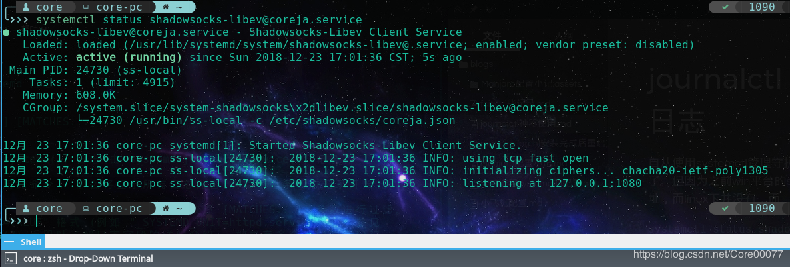
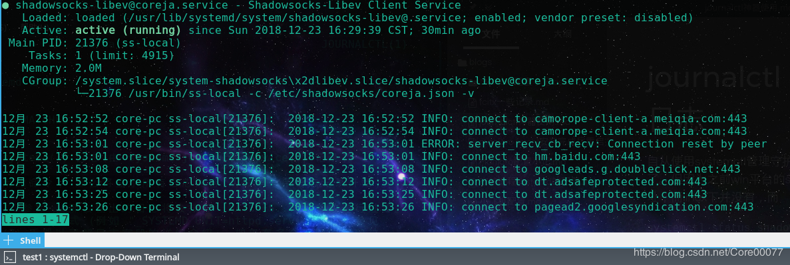
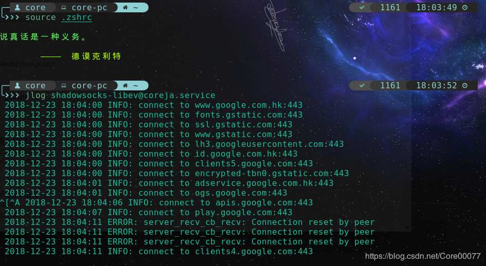

# 前言

自从使用systemctl管理守护进程之后，真香。我的小飞机可以开机自启动了。但因为之前win平台的ss有日志，可以实时看到使用ss访问的网页地址，而linux下并没有，而

`systemctl status shadowsocks-libev@xxx.service`

只能出来寥寥数行日志。



<!-- more -->

# 解决

怎么回事呢？原来是这个问题：

**ss-local需要加上 -v参数才有详细日志**

加了-v（verbose）之后直接就显示出了详细日志


---

另一个问题是以前的日志怎么显示呢？
而且systemctl status xxx.service做多只能显示20行，怎么办？

**这里就需要journalctl登场了！**

通俗的说，journalctl可以显示每个守护进程分别的（当然也可以一起显示）日志，还可以过滤日志的详略。我会在末尾附上journalctl的详细参数使用，这里列出几个我觉得比较常用的。

| 参数          | 作用                                                         | 例子                                      |
| ------------- | ------------------------------------------------------------ | ----------------------------------------- |
| -u            | (unit)指定某unit（服务）进行输出                             | journalctl -u xxx.service                 |
| -f            | (follow)会保持持续输出，不能和-r共用                         | journalctl -u -f xxx.service              |
| -r            | (reverse)反转输出（最新的日志先输出）                        | journalctl -r -u xxx.service              |
| -S            | (since)从指定时间以来到现在的日志，时间可以省略              | journalctl -r -S 2018-12-23 17:24:36      |
| -U            | (until)显示早于指定时间的日志                                | 同上，二者均可使用yesterday等，具体看手册 |
| -b            | 会指定从某次开机起至关机的日志，区分正负。默认值是-0，-1表示上一次开机，+1表示第一次开机。 | journalctl -f -u xxx.service -b           |
| -p            | 设置输出日志的优先级，0-7,从严重到不严重，比如4是输出0-4,7是输出0-7（4是warning，3是err） | journalctl -r -u xxx.service -p 4         |
| -o            | 控制输出的格式，推荐cat 包含时间+信息                        | journalctl -f -u xxx.service -o cat       |
| --disk-usage  | 显示日志文件磁盘用量                                         | journalctl --disk-usage                   |
| --vacuum-size | 清理（限制）日志文件的大小                                   | journalctl --vacuum-size 1G               |

然后在zshrc里设置了快捷使用的小名

`alias jlog='journalctl -f -o cat -u'`

以后直接 jlog xxx.service(补全)就方便多了。最后截个图给大家：



----

# 附录

>   ```shell
>   JOURNALCTL(1)                           journalctl                           JOURNALCTL(1)
>   
>   NAME
>          journalctl - 检索 systemd 日志
>   
>   SYNOPSIS
>          journalctl [OPTIONS...] [MATCHES...]
>   
>   描述
>          journalctl 可用于检索 systemd(1) 日志(由 systemd-journald.service(8) 记录)。
>   
>          如果不带任何参数直接调用此命令， 那么将显示所有日志内容(从最早一条日志记录开始)。
>   
>          如果指定了 [MATCHES...]  参数， 那么输出的日志将会按照 [MATCHES...]  参数进行过滤。
>          MATCHE 必须符合 "FIELD=VALUE" 格式 (例如 "_SYSTEMD_UNIT=httpd.service" )， 参见
>          systemd.journal-fields(7) 手册以了解日志字段的详细介绍。 如果有多个不同的字段被
>          [MATCHES...]  参数匹配， 那么这些字段之间使用"AND"逻辑连接，
>          也就是，日志项必须同时满足全部字段的匹配条件才能被输出。 如果同一个字段被多个
>          [MATCHES...]  参数匹配， 那么这些匹配条件之间使用"OR"逻辑连接，
>          也就是对于同一个字段，日志项只需满足任意一个匹配条件即可输出。 最后， "+"
>          字符可用作 [MATCHES...]  组之间的分隔符，并被视为使用"OR"逻辑连接。 也就是，MATCHE1
>          MATCHE2 + MATCHE3 MATCHE4 MATCHE5 + MATCHE6 MATCHE7 相当于 ( MATCHE1 MATCHE2 ) OR (
>          MATCHE3 MATCHE4 MATCHE5 ) OR ( MATCHE6 MATCHE7 )
>   
>          还可以使用绝对路径作为参数来过滤日志。
>          绝对路径可以是普通文件，也可以是软连接，但必须指向一个确实存在的文件。
>          如果路径指向了一个二进制可执行文件， 那么它实际上相当于是一个对 "_EXE="
>          字段的匹配(仅匹配完整的绝对路径)。 如果路径指向了一个可执行脚本，
>          那么它实际上相当于是一个对 "_COMM=" 字段的匹配(仅匹配脚本的文件名)。
>          如果路径指向了一个设备节点， 那么它实际上相当于是一个对 "_KERNEL_DEVICE="
>          字段的匹配(匹配该设备及其所有父设备的内核设备名称)。
>          在查询时，软连接会被追踪到底，内核设备名称将被合成，
>          父设备将按照当时的实际情况被提列出来。
>          因为日志项一般并不包含标记实际物理设备的字段，
>          所以，设备节点一般就是实际物理设备的最佳代表。
>          但是又因为设备节点与物理设备之间的对应关系在系统重启之后可能会发生变化，
>          所以，根据设备节点过滤日志仅对本次启动有意义，
>          除非你能确认对应关系在重启之后保持不变。
>   
>          可以使用 --boot, --unit= 等选项 进一步附加额外的约束条件(相当于使用"AND"逻辑连接)。
>   
>          最终的输出结果来自所有可访问的日志文件的综合，
>          无论这些日志文件是否正在滚动或者正在被写入，
>          也无论这些日志文件是属于系统日志还是用户日志， 只要有访问权限，就会被包括进来。
>   
>          用于提取日志的日志文件的集合可以使用 --user, --system, --directory, --file
>          选项进行筛选。
>   
>          每个用户都可以访问其专属的用户日志。 但是默认情况下， 只有root用户以及
>          "systemd-journal", "adm", "wheel" 组中的用户才可以访问全部的日志(系统与其他用户)。
>          注意，一般发行版还会给 "adm" 与 "wheel" 组一些其他额外的特权。 例如 "wheel"
>          组的用户一般都可以执行一些系统管理任务。
>   
>          默认情况下，结果会通过 less 工具进行分页输出， 并且超长行会在屏幕边缘被截断。
>          不过，被截掉的部分可以通过左右箭头按键查看。 如果不想分页输出，那么可以使用
>          --no-pager 选项，参见下面的"环境变量"小节。
>   
>          如果是输出到 tty 的话，行的颜色还会根据日志的级别变化： ERROR
>          或更高级别为红色，NOTICE 或更高级别为高亮，其他级别则正常显示。
>   
>   选项
>          能够识别的命令行选项如下：
>   
>          --no-full, --full, -l
>              如果字段内容超长则以省略号(...)截断以适应列宽。
>              默认显示完整的字段内容(超长的部分换行显示或者被分页工具截断)。
>   
>              老旧的 -l/--full 选项 仅用于撤销已有的 --no-full 选项，除此之外没有其他用处。
>   
>          -a, --all
>              完整显示所有字段内容， 即使其中包含不可打印字符或者字段内容超长。
>   
>          -f, --follow
>              只显示最新的日志项，并且不断显示新生成的日志项。 此选项隐含了 -n 选项。
>   
>          -e, --pager-end
>              在分页工具内立即跳转到日志的尾部。 此选项隐含了 -n1000
>              以确保分页工具不必缓存太多的日志行。 不过这个隐含的行数可以被明确设置的 -n
>              选项覆盖。 注意，此选项仅可用于 less(1) 分页器。
>   
>          -n, --lines=
>              限制显示最新的日志行数。 --pager-end 与 --follow 隐含了此选项。
>              此选项的参数：若为正整数则表示最大行数； 若为 "all" 则表示不限制行数；
>              若不设参数则表示默认值10行。
>   
>          --no-tail
>              显示所有日志行， 也就是用于撤销已有的 --lines= 选项(即使与 -f 连用)。
>   
>          -r, --reverse
>              反转日志行的输出顺序， 也就是最先显示最新的日志。
>   
>          -o, --output=
>              控制日志的输出格式。 可以使用如下选项：
>   
>              short
>                  这是默认值， 其输出格式与传统的 syslog[1] 文件的格式相似， 每条日志一行。
>   
>              short-iso
>                  与 short 类似，只是将时间戳字段以 ISO 8601 格式显示。
>   
>              short-precise
>                  与 short 类似，只是将时间戳字段的秒数精确到微秒级别。
>   
>              short-monotonic
>                  与 short 类似，只是将时间戳字段的零值从内核启动时开始计算。
>   
>              short-unix
>                  与 short 类似，只是将时间戳字段显示为从"UNIX时间原点"(1970-1-1 00:00:00
>                  UTC)以来的秒数。 精确到微秒级别。
>   
>              verbose
>                  以结构化的格式显示每条日志的所有字段。
>   
>              export
>                  将日志序列化为二进制字节流(大部分依然是文本) 以适用于备份与网络传输(详见
>                  Journal Export Format[2] 文档)。
>   
>              json
>                  将日志项按照JSON数据结构格式化， 每条日志一行(详见 Journal JSON Format[3]
>                  文档)。
>   
>              json-pretty
>                  将日志项按照JSON数据结构格式化， 但是每个字段一行， 以便于人类阅读。
>   
>              json-sse
>                  将日志项按照JSON数据结构格式化，每条日志一行，但是用大括号包围， 以适应
>                  Server-Sent Events[4] 的要求。
>   
>              cat
>                  仅显示日志的实际内容， 而不显示与此日志相关的任何元数据(包括时间戳)。
>   
>          --utc
>              以世界统一时间(UTC)表示时间
>   
>          --no-hostname
>              不显示来源于本机的日志消息的主机名字段。 此选项仅对 short
>              系列输出格式(见上文)有效。
>   
>          -x, --catalog
>              在日志的输出中增加一些解释性的短文本， 以帮助进一步说明日志的含义、
>              问题的解决方案、支持论坛、 开发文档、以及其他任何内容。
>              并非所有日志都有这些额外的帮助文本， 详见 Message Catalog Developer
>              Documentation[5] 文档。
>   
>              注意，如果要将日志输出用于bug报告， 请不要使用此选项。
>   
>          -q, --quiet
>              当以普通用户身份运行时， 不显示任何警告信息与提示信息。 例如："-- Logs begin at
>              ...", "-- Reboot --"
>   
>          -m, --merge
>              混合显示包括远程日志在内的所有可见日志。
>   
>          -b [ID][±offset], --boot=[ID][±offset]
>              显示特定于某次启动的日志， 这相当于添加了一个 "_BOOT_ID=" 匹配条件。
>   
>              如果参数为空(也就是 ID 与 ±offset 都未指定)， 则表示仅显示本次启动的日志。
>   
>              如果省略了 ID ， 那么当 ±offset 是正数的时候， 将从日志头开始正向查找，
>              否则(也就是为负数或零)将从日志尾开始反响查找。 举例来说， "-b
>              1"表示按时间顺序排列最早的那次启动， "-b 2"则表示在时间上第二早的那次启动； "-b
>              -0"表示最后一次启动， "-b -1"表示在时间上第二近的那次启动， 以此类推。 如果
>              ±offset 也省略了， 那么相当于"-b -0"， 除非本次启动不是最后一次启动(例如用
>              --directory 指定了另外一台主机上的日志目录)。
>   
>              如果指定了32字符的 ID ， 那么表示以此 ID 所代表的那次启动为基准
>              计算偏移量(±offset)， 计算方法同上。 换句话说， 省略 ID 表示以本次启动为基准
>              计算偏移量(±offset)。
>   
>          --list-boots
>              列出每次启动的 序号(也就是相对于本次启动的偏移量)、32字符的ID、
>              第一条日志的时间戳、最后一条日志的时间戳。
>   
>          -k, --dmesg
>              仅显示内核日志。隐含了 -b 选项以及 "_TRANSPORT=kernel" 匹配项。
>   
>          -t, --identifier=SYSLOG_IDENTIFIER
>              仅显示 syslog[1] 识别符为 SYSLOG_IDENTIFIER 的日志项。
>   
>              可以多次使用该选项以指定多个识别符。
>   
>          -u, --unit=UNIT|PATTERN
>              仅显示属于特定单元的日志。 也就是单元名称正好等于 UNIT 或者符合 PATTERN
>              模式的单元。 这相当于添加了一个 "_SYSTEMD_UNIT=UNIT" 匹配项(对于 UNIT 来说)，
>              或一组匹配项(对于 PATTERN 来说)。
>   
>              可以多次使用此选项以添加多个并列的匹配条件(相当于用"OR"逻辑连接)。
>   
>          --user-unit=
>              仅显示属于特定用户会话单元的日志。 相当于同时添加了 "_SYSTEMD_USER_UNIT=" 与
>              "_UID=" 两个匹配条件。
>   
>              可以多次使用此选项以添加多个并列的匹配条件(相当于用"OR"逻辑连接)。
>   
>          -p, --priority=
>              根据日志等级(包括等级范围)过滤输出结果。 日志等级数字与其名称之间的对应关系如下
>              (参见 syslog(3))： "emerg" (0), "alert" (1), "crit" (2), "err" (3),
>              "warning" (4), "notice" (5), "info" (6), "debug" (7) 。
>              若设为一个单独的数字或日志等级名称， 则表示仅显示小于或等于此等级的日志
>              (也就是重要程度等于或高于此等级的日志)。 若使用 FROM..TO.. 设置一个范围，
>              则表示仅显示指定的等级范围内(含两端)的日志。 此选项相当于添加了 "PRIORITY="
>              匹配条件。
>   
>          -c, --cursor=
>              从指定的游标(cursor)开始显示日志。
>              [提示]每条日志都有一个"__CURSOR"字段，类似于该条日志的指纹。
>   
>          --after-cursor=
>              从指定的游标(cursor)之后开始显示日志。 如果使用了 --show-cursor 选项，
>              则也会显示游标本身。
>   
>          --show-cursor
>              在最后一条日志之后显示游标， 类似下面这样，以"--"开头：
>   
>                  -- cursor: s=0639...
>   
>              游标的具体格式是私有的(也就是没有公开的规范)， 并且会变化。
>   
>          -S, --since=, -U, --until=
>              显示晚于指定时间(--since=)的日志、显示早于指定时间(--until=)的日志。
>              参数的格式类似 "2012-10-30 18:17:16" 这样。 如果省略了"时:分:秒"部分，
>              则相当于设为 "00:00:00" 。 如果仅省略了"秒"的部分则相当于设为 ":00" 。
>              如果省略了"年-月-日"部分， 则相当于设为当前日期。 除了"年-月-日 时:分:秒"格式，
>              参数还可以进行如下设置： (1)设为 "yesterday", "today", "tomorrow"
>              以表示那一天的零点(00:00:00)。 (2)设为 "now" 以表示当前时间。
>              (3)可以在"年-月-日 时:分:秒"前加上 "-"(前移) 或 "+"(后移)
>              前缀以表示相对于当前时间的偏移。 关于时间与日期的详细规范， 参见
>              systemd.time(7)
>   
>          -F, --field=
>              显示所有日志中某个字段的所有可能值。 [译者注]类似于SQL语句："SELECT DISTINCT
>              某字段 FROM 全部日志"
>   
>          -N, --fields
>              输出所有日志字段的名称
>   
>          --system, --user
>              仅显示系统服务与内核的日志(--system)、 仅显示当前用户的日志(--user)。
>              如果两个选项都未指定，则显示当前用户的所有可见日志。
>   
>          -M, --machine=
>              显示来自于正在运行的、特定名称的本地容器的日志。 参数必须是一个本地容器的名称。
>   
>          -D DIR, --directory=DIR
>              仅显示来自于特定目录中的日志， 而不是默认的运行时和系统日志目录中的日志。
>   
>          --file=GLOB
>              GLOB 是一个可以包含"?"与"*"的文件路径匹配模式。 表示仅显示来自与指定的 GLOB
>              模式匹配的文件中的日志， 而不是默认的运行时和系统日志目录中的日志。
>              可以多次使用此选项以指定多个匹配模式(多个模式之间用"OR"逻辑连接)。
>   
>          --root=ROOT
>              在对日志进行操作时， 将 ROOT 视为系统的根目录。 例如 --update-catalog 将会创建
>              ROOT/var/lib/systemd/catalog/database
>   
>          --new-id128
>              此选项并不用于显示日志内容， 而是用于重新生成一个标识日志分类的 128-bit ID 。
>              此选项的目的在于 帮助开发者生成易于辨别的日志消息， 以方便调试。
>   
>          --header
>              此选项并不用于显示日志内容， 而是用于显示日志文件内部的头信息(类似于元数据)。
>   
>          --disk-usage
>              此选项并不用于显示日志内容，
>              而是用于显示所有日志文件(归档文件与活动文件)的磁盘占用总量。
>   
>          --vacuum-size=, --vacuum-time=, --vacuum-files=
>              这些选项并不用于显示日志内容，
>              而是用于清理日志归档文件(并不清理活动的日志文件)， 以释放磁盘空间。
>              --vacuum-size= 可用于限制归档文件的最大磁盘使用量 (可以使用 "K", "M", "G", "T"
>              后缀)； --vacuum-time= 可用于清除指定时间之前的归档 (可以使用 "s", "m", "h",
>              "days", "weeks", "months", "years" 后缀)； --vacuum-files=
>              可用于限制日志归档文件的最大数量。 注意，--vacuum-size= 对 --disk-usage
>              的输出仅有间接效果， 因为 --disk-usage 输出的是归档日志与活动日志的总量。
>              同样，--vacuum-files= 也未必一定会减少日志文件的总数，
>              因为它同样仅作用于归档文件而不会删除活动的日志文件。
>              此三个选项可以同时使用，以同时从三个维度去限制归档文件。
>              若将某选项设为零，则表示取消此选项的限制。
>   
>          --list-catalog [128-bit-ID...]
>              简要列出日志分类信息， 其中包括对分类信息的简要描述。
>   
>              如果明确指定了分类ID(128-bit-ID)， 那么仅显示指定的分类。
>   
>          --dump-catalog [128-bit-ID...]
>              详细列出日志分类信息 (格式与 .catalog 文件相同)。
>   
>              如果明确指定了分类ID(128-bit-ID)， 那么仅显示指定的分类。
>   
>          --update-catalog
>              更新日志分类索引二进制文件。
>              每当安装、删除、更新了分类文件，都需要执行一次此动作。
>   
>          --setup-keys
>              此选项并不用于显示日志内容， 而是用于生成一个新的FSS(Forward Secure
>              Sealing)密钥对。 此密钥对包含一个"sealing key"与一个"verification key"。
>              "sealing key"保存在本地日志目录中， 而"verification key"则必须保存在其他地方。
>              详见 journald.conf(5) 中的 Seal= 选项。
>   
>          --force
>              与 --setup-keys 连用， 表示即使已经配置了FSS(Forward Secure Sealing)密钥对，
>              也要强制重新生成。
>   
>          --interval=
>              与 --setup-keys 连用，指定"sealing key"的变化间隔。
>              较短的时间间隔会导致占用更多的CPU资源， 但是能够减少未检测的日志变化时间。
>              默认值是 15min
>   
>          --verify
>              检查日志文件的内在一致性。 如果日志文件在生成时开启了FSS特性， 并且使用
>              --verify-key= 指定了FSS的"verification key"，
>              那么，同时还将验证日志文件的真实性。
>   
>          --verify-key=
>              与 --verify 选项连用， 指定FSS的"verification key"
>   
>          --sync
>              要求日志守护进程将所有未写入磁盘的日志数据刷写到磁盘上，
>              并且一直阻塞到刷写操作实际完成之后才返回。 因此该命令可以保证当它返回的时候，
>              所有在调用此命令的时间点之前的日志， 已经全部安全的刷写到了磁盘中。
>   
>          --flush
>              要求日志守护进程 将 /run/log/journal 中的日志数据 刷写到 /var/log/journal 中
>              (如果持久存储设备当前可用的话)。 此操作会一直阻塞到操作完成之后才会返回，
>              因此可以确保在该命令返回时， 数据转移确实已经完成。
>              注意，此命令仅执行一个单独的、一次性的转移动作， 若没有数据需要转移，
>              则此命令什么也不做， 并且也会返回一个表示操作已正确完成的返回值。
>   
>          --rotate
>              要求日志守护进程滚动日志文件。 此命令会一直阻塞到滚动完成之后才会返回。
>   
>          -h, --help
>              显示简短的帮助信息并退出。
>   
>          --version
>              显示简短的版本信息并退出。
>   
>          --no-pager
>              不将程序的输出内容管道(pipe)给分页程序。
>   
>   退出状态
>          返回值为 0 表示成功， 非零返回值表示失败代码。
>   
>   环境变量
>          $SYSTEMD_PAGER
>              指定分页程序。仅在未指定 --no-pager 选项时有意义。 此变量会覆盖 $PAGER 的值。
>              将此变量设为空字符串或 "cat" 等价于使用 --no-pager 选项。
>   
>          $SYSTEMD_LESS
>              用于覆盖 默认传递给 less 程序的命令行选项 ("FRSXMK")。
>   
>   例子
>          不带任何选项与参数，表示显示全部日志
>   
>              journalctl
>   
>          仅指定一个匹配条件， 显示所有符合该匹配条件的日志
>   
>              journalctl _SYSTEMD_UNIT=avahi-daemon.service
>   
>          指定了两个不同字段的匹配条件， 显示同时满足两个匹配条件的日志
>   
>              journalctl _SYSTEMD_UNIT=avahi-daemon.service _PID=28097
>   
>          指定了同一个字段的两个不同匹配条件， 显示满足其中任意一个条件的日志
>   
>              journalctl _SYSTEMD_UNIT=avahi-daemon.service _SYSTEMD_UNIT=dbus.service
>   
>          使用 "+" 连接两组匹配条件， 相当于逻辑"OR"连接
>   
>              journalctl _SYSTEMD_UNIT=avahi-daemon.service _PID=28097 + _SYSTEMD_UNIT=dbus.service
>   
>          显示所有 D-Bus 进程产生的日志
>   
>              journalctl /usr/bin/dbus-daemon
>   
>          显示上一次启动所产生的所有内核日志
>   
>              journalctl -k -b -1
>   
>          持续显示 apache.service 服务不断生成的日志
>   
>              journalctl -f -u apache
>   
>   参见
>          systemd(1), systemd-journald.service(8), systemctl(1), coredumpctl(1),
>          systemd.journal-fields(7), journald.conf(5), systemd.time(7)
>   
>   NOTES
>           1. syslog
>              //linux/sysklogd.html
>   
>           2. Journal Export Format
>              http://www.freedesktop.org/wiki/Software/systemd/export
>   
>           3. Journal JSON Format
>              http://www.freedesktop.org/wiki/Software/systemd/json
>   
>           4. Server-Sent Events
>              https://developer.mozilla.org/en-US/docs/Server-sent_events/Using_server-sent_events
>   
>           5. Message Catalog Developer Documentation
>              http://www.freedesktop.org/wiki/Software/systemd/catalog
>   
>   跋
>          本页面中文版由中文 man 手册页计划提供。
>   
>          翻译人员：金步国
>          金步国作品集：http://www.jinbuguo.com
>          中文 man 手册页计划：https://github.com/man-pages-zh/manpages-zh
>   
>   systemd 231                                                                  JOURNALCTL(1)
>   
>   ```
>
>
