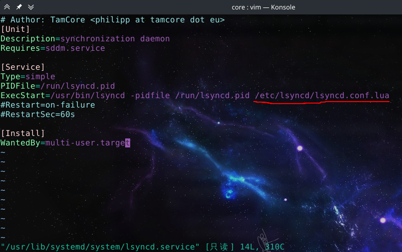
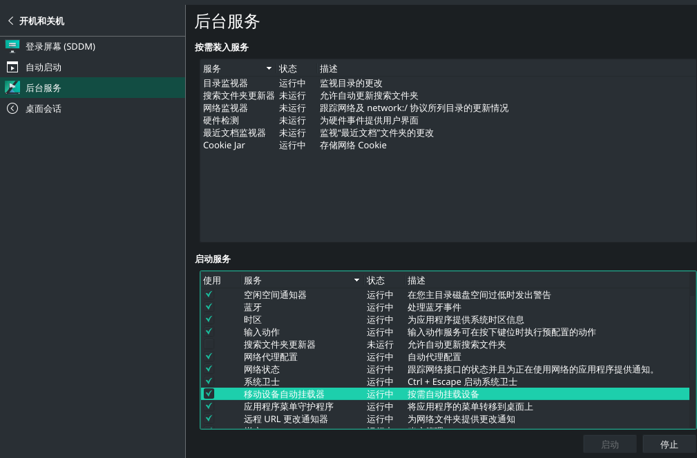
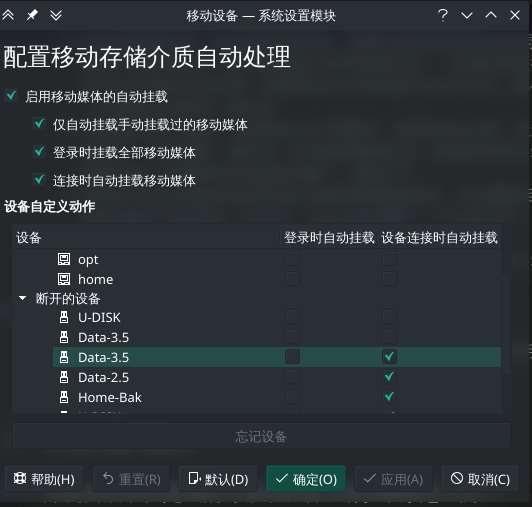

# 简介

自从有一次不小心把home目录删没了，还有一次调整分区大小不小心把home给格没了，我就长心眼了。一定要数据备份。

然后统计了一下，我的个龟龟，30w个文件我拿**命**备份啊，文件倒是不到（迁移了一部分在移动硬盘里），但是qq聊天记录那些乱七八糟的表情包啊小图片啊，光这一部分就有8w个文件，淦。自然就想到了增量备份。


我比较懒就不发引用了，增量同步大致就有点像git仓库，原理上是会根据文件差异来传输文件，而不是一股脑把所有文件都拷过去（当然它肯定没法像git一样回溯）
<!-- more -->
# 安装、配置与使用

## 原理

其实lsyncd[^3]它使用的工具是**rsync**+**inotify**。rsync是linux自带的，几乎所有发行版应该都有这个工具，你们也可以尝试一下，直接`rsync -av /home/core /tmp/xxx`就好了。第一次拷因为很大所以慢，但是在做出一些修改之后，第二次使用同样的命令就非常快了，只会拷贝修改的文件，具体其它骚操作可以看这里Linux文件同步工具-rsync[^2]或者直接man一下手册。

关于lsync的原理下面直接引用大佬的发言[^1]，本文主要参考的就是这篇了

> Lysncd 实际上是lua语言封装了 inotify 和 rsync 工具，采用了 Linux 内核（2.6.13 及以后）里的 inotify 触发机制，然后通过rsync去差异同步，达到实时的效果。我认为它最令人称道的特性是，完美解决了 `inotify + rsync`海量文件同步带来的文件频繁发送文件列表的问题 —— 通过时间延迟或累计触发事件次数实现。另外，它的配置方式很简单，lua本身就是一种配置语言，可读性非常强。lsyncd也有多种工作模式可以选择，本地目录cp，本地目录rsync，远程目录rsyncssh。

## 安装

作为arch系，aur里怎么可能没有包，一顿`yay -Sy lsyncd`搞定。（yaourt已经过时啦赶紧yay用起来）

## 配置

这个包最骚的是它丫竟然没有给默认配置，我：？？？

还好文档还是有的，感谢大佬^[1]^做了大部分翻译工作，欢迎直接参考，这边只说几个大佬网站上没讲的部分。

安好了之后并没有任何指导，但你知道它是个daemon，所以问题不大，`vim /usr/lib/systemd/system/lsyncd.service`，就能看到它的daemon的配置文件



（这里面注释的是我自己写后来删掉了，其余的应该和刚装好没什么区别。）

红线备注出来的部分便是配置文件了，当然你打开这个目录的时候会发现它并没有目录，也没有给默认配置，这就需要配置文件了，具体的规则在大佬的博客^[1]^里写得很清楚了，他是把原本的官方文档[^4]翻译了一波。

这里我对着我自己的配置简单说一下要注意的地方

```lua
settings {
    nodaemon=false,
    maxProcesses=4
}

sync {
    default.rsync,
    source="/home/core",
    target="/run/media/core/Home-Bak/core",
    delay=4000,
    delete="startup",
    excludeFrom="/home/core/.config/lsyncd.exclude",
    rsync={
        binary="/usr/bin/rsync",
        archive=true,
        compress=false,
        verbose=false
    }
}

sync {
    default.rsync,
    source="/run/media/core/Data-2.5",
    target="/run/media/core/Data-3.5/Data-2.5",
    delay=7000,
    delete="startup",
    rsync={
        binary="/usr/bin/rsync",
        archive=true,
        compress=false,
        verbose=false
    }
}
```

1. 整体设置里nodaemon要设为false，这样你才是后台运行
2. source是源目录，target是目标目录，需要注意的是如果你的目录后面加了/，那么它只会拷这个目录下的所有文件（而不会把这个目录也拷过去）。比如这里是把/home/core整个目录拷到/home-Bak/core目录，如果我source写的是/home/core/，那么就会把core目录下的所有文件（不包括core目录）拷过去
3. 文档里介绍了rsync、ssh和direct三种模式，虽然说direct快，但还是推荐使用rsync，因为后者能把文件、文件权限、属性等一大堆东西都拷过去（前提是目标目录也得是同样的分区格式，比如我是ext4）,如果拷到ntfs那就没辙了，都是777。
4. delete=startup是指同步的时候只做新增和覆盖操作，不会删除目标目录里的内容，只会在开机的时候执行完全同步（白话文：source里你删了一个文件之后，同步的时候不会把target里对应的文件删掉，这个操作只会在开机的时候执行）
5. delay是延迟多长时间同步，默认是15s，我感觉太短，设置成了3000s和7000s

## 使用

把配置文件写好了之后`sudo systemctl start lsyncd.service`就能使用啦。

加入开机启动列表：`sudo systemctl enable lsyncd.service`

# 常见问题与解决

## 开机自启动但是我的可移动设备没有挂载该怎么办？

对于kde平台，在`系统设置-开机和关机-后台服务`里先启用自动挂载服务



然后在`系统设置-可移动设备`里有一个自动挂载配置，会有一个挂载选项，根据需求选择登录时挂载/连接时挂载即可。



其它桌面平台应该都有类似的设置，靠你们自己找咯，反正我第一个接触的桌面平台就是manjaro-kde嘿嘿嘿

但是这里还没有结束，因为你会发现设备的自动挂载是在sddm那个界面输入了密码**之后**才进行的，而使用`sudo systemctl enable lsyncd.service`会让它在这之前就启动服务。

所以这里需要disable掉lsyncd这个服务：`sudo systemctl disable lsyncd.service`，然后让每次输入完密码之后start服务。

具体做法是，`系统设置-开机和关机-自启动`有个添加脚本，事先写好一个可执行的脚本就好啦，然后添加进来就好啦。（我后来把ss和aria2cd都放这里面了，感觉登录之后再启动的逻辑更好一点（毕竟属于用户自定义的启动进程嘛）


最后一句，如果你的sudo需要输入密码的话这个部分就不好使了，自己visudo让sudo命令执行特定指令不需要密码吧。

## 如果我的可移动设备没有连接会怎么办？

试试就知道了，这个daemon的状态会fail，重新连接设备并且挂载之后`sudo systemctl restart lsyncd.service`即可。

## 对于笔记本来说这个服务开着很费电？

对于笔记本来说，其实开机自启动并不够友善，而且在使用电池或者没有备份的设备（移动硬盘）没有连接到电脑时很尴尬。前者会增加耗电量，降低续航，后者则会导致服务会fail。这里还是以kde plasma平台为例讲一下我的做法。

其实原理很简单，写好特定的脚本，在交流电和电池切换的时候触发执行即可。

首先kde plasma桌面在`系统设置-开机和关机-自动启动`有一个开机自启动管理，要做的事情很简单

1. 写一个脚本，用来打开这个服务（像我前面写的那样）

2. 再写一个脚本，用来关闭这个服务（像我前面写的那样）

3. 找到`配置电源设置`，在交流供电和电池供电的`运行脚本`这里执行我们特定的脚本（打开和关闭服务），如下图

   

# 参考资料

[^1]: [lsyncd实时同步搭建指南——取代rsync+inotify](http://seanlook.com/2015/05/06/lsyncd-synchronize-realtime/)
[^2]: [Linux文件同步工具-rsync](https://blog.51cto.com/chenshengsheng/2115262)
[^3]: [lsyncd github](https://github.com/axkibe/lsyncd)
[^4]: [官方配置文档](http://axkibe.github.io/lsyncd/manual/config/layer4/)

